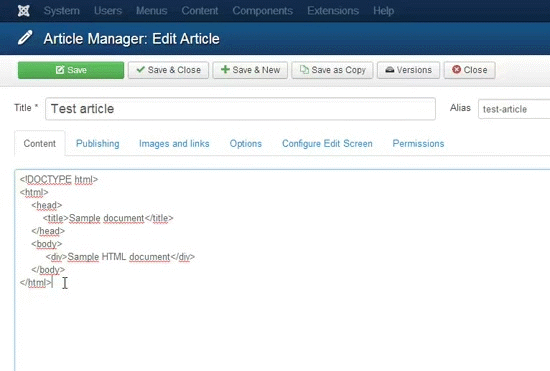

Ace Anywhere
===========================

Transform any textarea into a code editor with this Chrome browser extension!
Ace Anywhere uses the [Ace code editor](http://ace.c9.io/).

##Instalation
1. Download `AceAnywhere.crx`
2. Open Chrome's extension manager `chrome://extensions/`
3. Drag the download file and drop it in the extension manager

##Features / Usage
Ace Anywhere creates a context menu available on all editable fields (input, textarea, etc).

Use the `Ace it!` menu to transform the field into an [Ace Code Editor](http://ace.c9.io/).

Syntax highlighting is available through the `Languages` menu. Themes are also made available through the `Themes` menu.

Word wrapping can be enabled or disabled through the `Preferences > Toggle Word Wrapping`.

###Advanced usage
You can manage the editor using Chrome's developer tools console (hotkey `F12`), by accessing the `editor` variable.

For more information see [Ace's How-To Guide](http://ace.c9.io/#nav=howto).

##Contributing
Contributions welcome via pull request!

##Licence
Ace Anywhere is licensed under the MIT License. Please see `LICENSE.txt` file distributed with this software.
